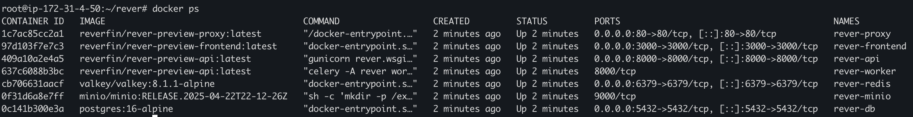

# Self Hosting Rever on your server

Follow these steps to install Rever on your server. We use Docker Compose to make the setup easy.
We recommend a Linux server with at least 4GB of RAM and 10GB of storage.

## Prerequisites

- A Linux server with Docker support
- Domain name (optional but recommended for production use)
- SMTP server credentials for sending emails

## Installation Steps

### 1. Install Docker using the convenience script

```bash
curl -fsSL https://get.docker.com | bash
```

### 2. Install Docker Compose plugin

```bash
DOCKER_CONFIG=${DOCKER_CONFIG:-$HOME/.docker}
mkdir -p $DOCKER_CONFIG/cli-plugins
curl -SL https://github.com/docker/compose/releases/download/v2.2.3/docker-compose-linux-x86_64 -o $DOCKER_CONFIG/cli-plugins/docker-compose
chmod +x $DOCKER_CONFIG/cli-plugins/docker-compose
```

### 3. Create Rever directory

```bash
mkdir rever
cd rever
```

### 4. Download docker-compose.yaml and .env.example from the GitHub repo

```bash
curl -fsSL -o docker-compose.yaml https://raw.githubusercontent.com/makerever/rever/main/docker-compose.yaml
curl -fsSL -o .env https://raw.githubusercontent.com/makerever/rever/main/api/.env.selfhosted.example
```

> **Note:** If you want to deploy a specific release use the <RELEASE> urls.

```BASH
curl -fsSL -o docker-compose.yaml https://raw.githubusercontent.com/makerever/rever/refs/tags/<RELEASE>/docker-compose.yaml
curl -fsSL -o .env https://raw.githubusercontent.com/makerever/rever/refs/tags/<RELEASE>/api/.env.selfhosted.example
```

### 5. Configure your .env file

At the very least, we recommend you:

1. Change the database password (`DB_PASSWORD`)
2. Configure your SMTP settings:

   - `EMAIL_HOST` - Your SMTP server address
   - `EMAIL_PORT` - Your SMTP server port (typically 587 for TLS)
   - `EMAIL_HOST_USER` - Your SMTP username
   - `EMAIL_HOST_PASSWORD` - Your SMTP password
   - `DEFAULT_FROM_EMAIL` - The email address that will appear as the sender

3. Update these 3 settings with your domain or IP address for CORS to work properly:
   ```
   ALLOWED_HOSTS=yourdomain.com
   CORS_ALLOWED_ORIGINS=http://yourdomain.com
   APP_URL=http://yourdomain.com
   ```

> **Note:** If you are using the Docker container PostgreSQL database and Minio, we recommend you periodically back up your data from both these containers.

### 6. Start Rever containers

```bash
docker compose up -d
```

Once this step is complete, you should see all the containers running. You can check their status with:

```bash
docker compose ps
```



### 7. Run database migrations

```bash
docker exec -it rever-api python manage.py migrate
```

### 8. Access Rever

Go to your domain address or IP in your browser to access Rever! 🎉

## Setting up HTTPS (Recommended for Production)

For production environments, we strongly recommend setting up HTTPS. You will need to configure your own proxy with certificates.

[https-portal](https://github.com/SteveLTN/https-portal) provides a simple setup for this purpose.

## Troubleshooting

If you encounter any issues:

1. Check container logs:

   ```bash
   docker compose logs
   ```

2. Visit our [GitHub repository](https://github.com/makerever/rever) for more information or to report issues.
