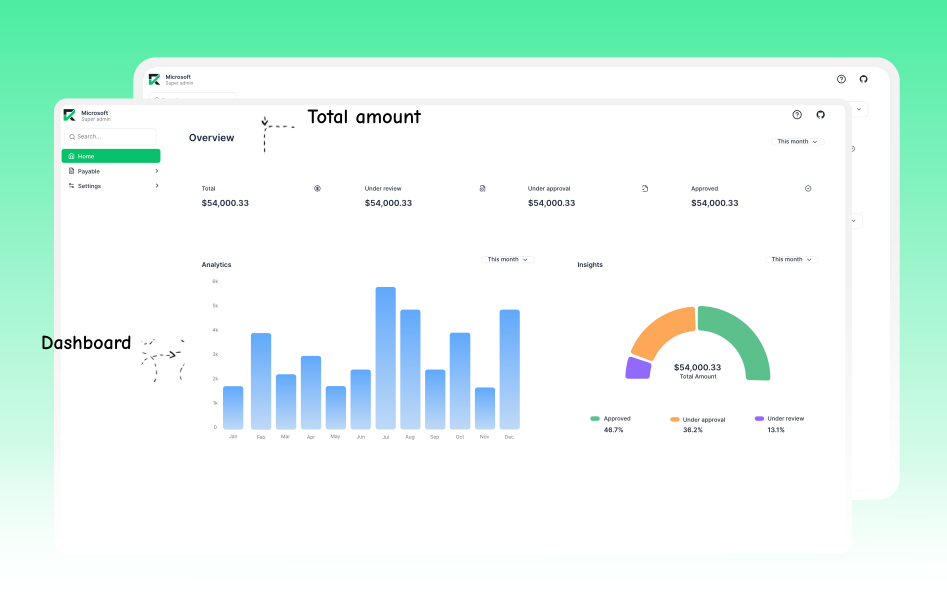
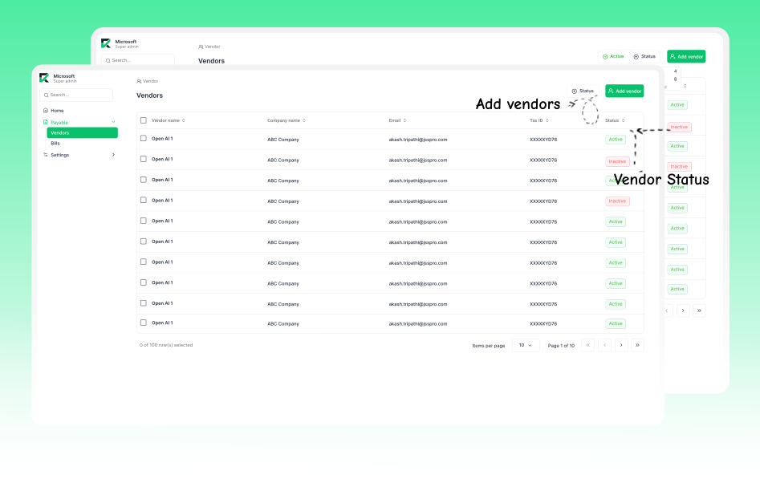
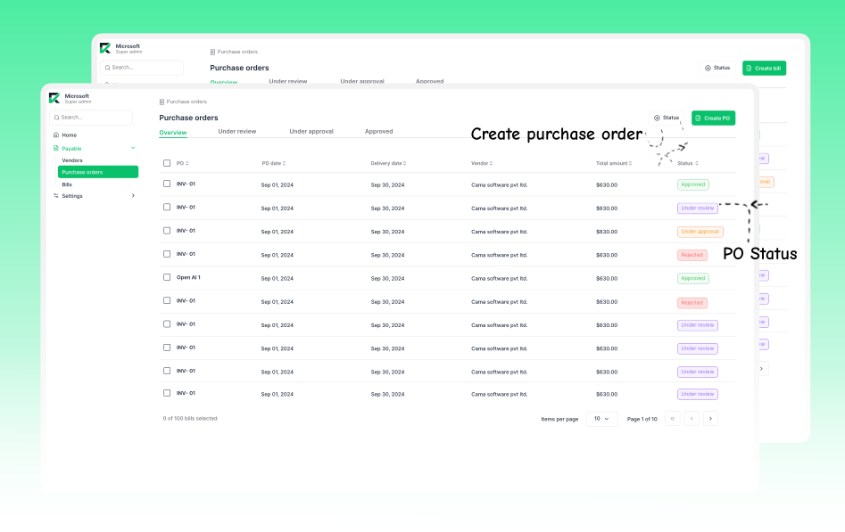
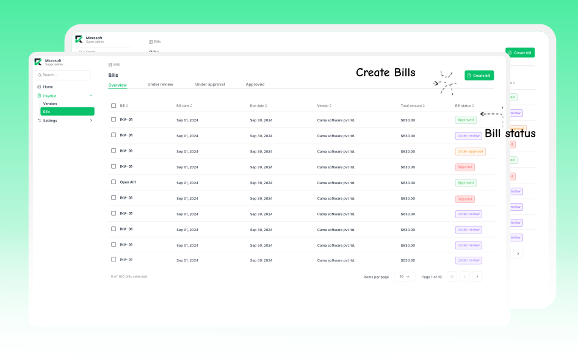
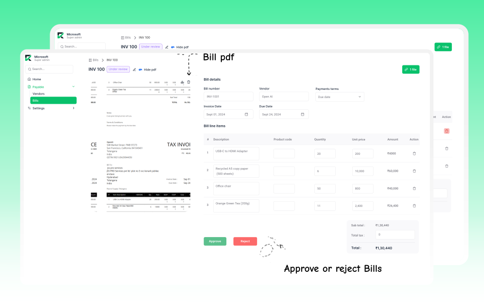
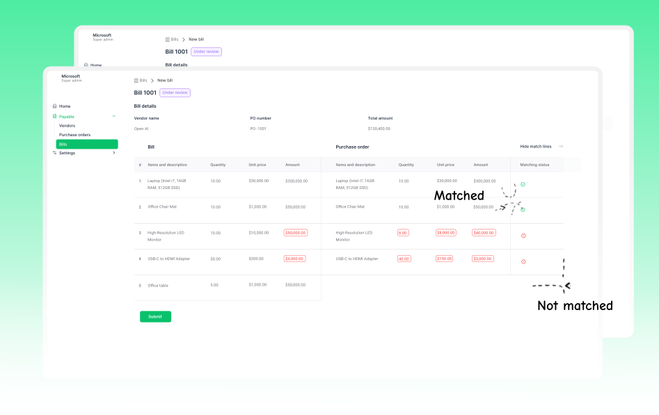

# Rever

  

  
  
  

## Overview

Rever AI-powered finance automation that elevates control, unifies systems, and enables foresight for modern CFOs.

- 📊 From reconciliations to real-time insights
- 🧾 From fragmented workflows to connected finance
- 🤖 From reactive firefighting to intelligent decision-making

### **🌍 [Website](https://reverfin.ai) • [Community](https://community.reverfin.ai)**

### Evolution of Rever

Over a decade of building Virtual CFO practices taught us two things:
Every growing business has non-standard financial processes

Every standard reporting tool struggles to turn them into actionable insights

The result? Fragmented systems. Overburdened accountants. Missed opportunities.
Rever was born to fix this, an AI-enabled Finance Copilot that simplifies, streamlines, and supercharges the modern finance function.

## **Installation**

Getting started is easy:

### **🔹 Rever Cloud (coming soon)**

Our fastest deployment option. Full-featured, secure, and hosted for you.

### **🔹 Self-Hosted**

Deploy Rever on your infrastructure. Full control, full compliance.

For self hosting Rever on your server please check [Self-Hosting Rever](INSTALL_SELF_HOSTED.md). You do not need to clone the repository if you just want to self-host.

## **Core Features:**

### 🔹 **Key Features of Rever**

1. **Vendor Management**: Create, view, and manage vendor records in a centralized Vendor Master.
   Maintain critical details such as contact info, bank details, and audit history. Designed to eliminate duplicates and ensure consistent data across all transactions.

2. **Purchase Orders (POs)** Easily create and manage purchase orders with structured fields for items, quantities, and pricing.
   POs are stored in a centralized PO Master, enabling tracking, approvals, and integration with bills for seamless procurement-to-payment workflows.

3. **Bill Management & Two-Way Matching** Create bills manually or ingest them via automation (in future versions).
   Bills can be associated with vendor records and compared against POs through a two-way match, verifying quantities and amounts between bill and PO. This improves accuracy and prevents overbilling or mismatched invoices.

4. **Approval Workflows** Integrated approval flows across both bills and POs, allowing teams to route documents 
   for review and sign-off before execution. 

5. **Audit History** Every action on a bill: creation, updates, approvals are logged in a detailed audit trail.
   This ensures traceability, supports compliance requirements, and aids in internal or external audits.

## **Built With**

- **Backend**: Python · Django · PostgreSQL

- **Frontend**: React · Next.js · TypeScript

- **Infra & AI(Coming Soon)**: Redis · RPA pipelines · OCR \+ NLP AI Models

- **Integrations(Coming Soon)**: QuickBooks · Xero · NetSuite · Zoho · Custom APIs

---

## **Screenshots**

  

  

  

  

  

  

### 🔹 **Upcoming Features**

1. **Document Management System (DMS)**
   A module to upload, tag, and manage supporting documents like contracts, invoices, and receipts: all linked to POs and bills.

2. **3-Way Matching**
   Go beyond 2-way matching by comparing POs, Bills, and Goods Receipt Notes for tighter control over payments and deliveries.

3. **Request Receipts**
   Let internal teams or external vendors request receipt confirmations, helping close the loop in procurement workflows.

4. **Advanced Analytics**
   Dashboards and insights to visualize spend patterns, approval cycle times, vendor performance, and more.

## **Documentation**

Explore how ReverI works from setting up your environment to integrating with your existing systems. Detailed walkthroughs for CFOs, controllers, and finance ops teams.

## **Community**

Join our community of CFOs, controllers, founders, and builders.

- 📍 Join [Discourse Community](https://community.reverfin.ai)
- 💬 Ask questions, share your setup, suggest features, or just say hi!

We value open conversations, practical feedback, and ambitious finance leaders who want to build a better future.

## **Security**

Security is at the core of financial trust. Found a vulnerability? Please report it responsibly.  
 \*📩 Email: **support@reverfin.ai***

## **Contributing**

Want to contribute?

- Share feedback from your finance ops journey
- Help improve our integrations
- Write use case articles or tutorials
- Contribute to our growing intelligence layer

Start here: [Contributing Guidelines](CONTRIBUTING.md)

## **🧭 License**

This project is licensed under the GNU Affero General Public License v3.0 (AGPL-3.0) - see the [LICENSE](LICENSE) file for details.

## **💬 About**

Rever is built by finance practitioners who’ve lived the chaos and technologists who knew it could be done better. It’s the result of a decade’s worth of problems, distilled into one intelligent platform.
A **Virtual CFO System** purpose-built to **preserve and enhance stakeholder value**, decision by decision.

  Made with ❤️ by the <a href="https://reverfin.ai">Rever</a> team

